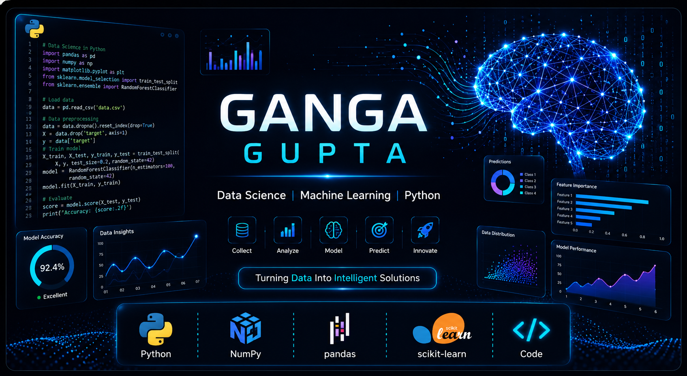

# 👋 Hi, I'm Ganga Gupta

  

<h2 align="center">🌍 Let's Connect</h2>

I'm always open to discussing Data Science, Machine Learning, and exciting projects.

  

  

  

---

## 🚀 About Me

🎓 B.Tech Data Science Student

📊 Passionate about Data Analytics, Machine Learning and AI.

💡 I enjoy transforming raw data into meaningful insights through analysis and visualization.

---

## 🧠 Current Mission

- 📈 Master Machine Learning
- 📊 Build real-world Data Science projects
- 🌐 Deploy apps using Streamlit
- 🏆 Contribute consistently on GitHub

---

## 🚀 Tech Stack

### 🖥️ Languages  
&nbsp;&nbsp; 
 

### 📊 Data Science Libraries  
&nbsp;&nbsp; 
 
 
 
 
 

### 🛠️ Development Tools  
&nbsp;&nbsp; 
 

### ☁️ Platforms  
&nbsp;&nbsp; 
 

---

## 📂 Featured Projects

- 🏡 House Price Prediction
- 🎓 Student Placement Prediction
- 📊 Exploratory Data Analysis
- 🌐 Streamlit ML Apps

---

## 📈 GitHub Stats

---

## 📊 Contribution Graph

---

## 🏆 GitHub Trophies

---

## ☕ Fun Facts

- I believe every dataset tells a story.
- Learning something new every day.
- Coffee + Python + Music = Productive day.
- “You can have it all. Just not all at once.”

---

## 🌍 Connect

- LinkedIn: https://www.linkedin.com/in/ganga-gupta01
- Email: binac569@gmail.com

---

> *"The goal is to turn data into information, and information into insight."*

⭐ Thanks for visiting my profile!
